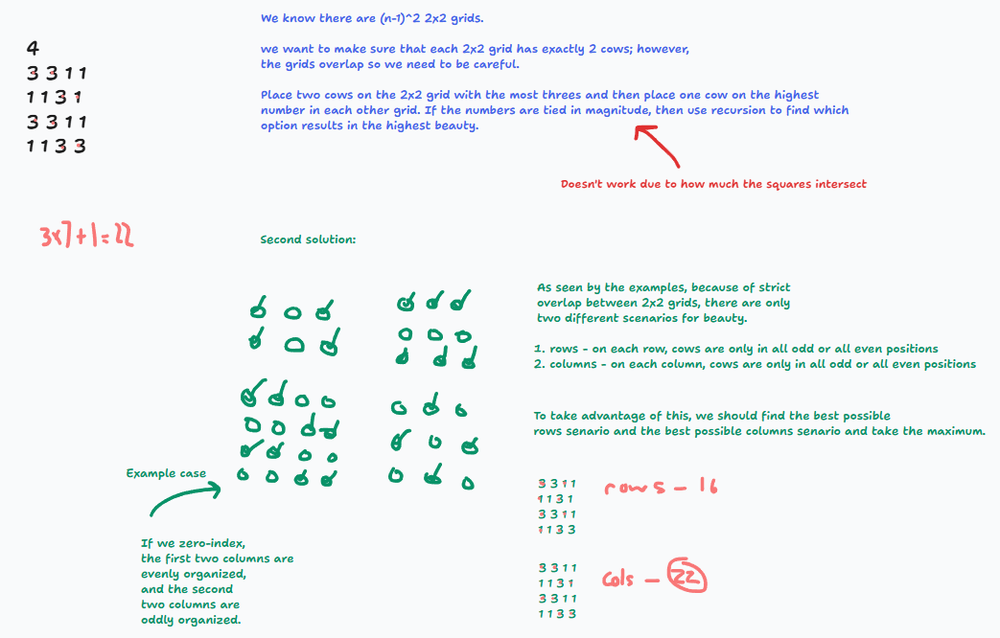

## Spaced Out (USACO Silver)

This problem mainly helped me understand the complexities of overlapping 2x2 grids. I learned that consistent parity across rows and columns effects the amount of overlapping squares.

My thought process:

